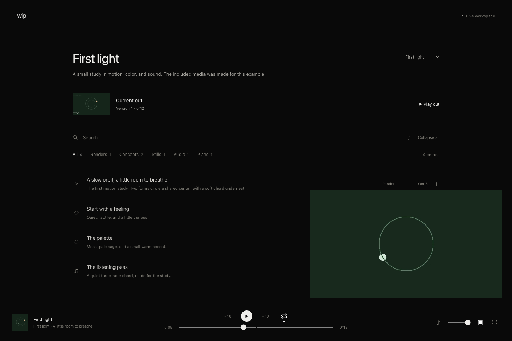
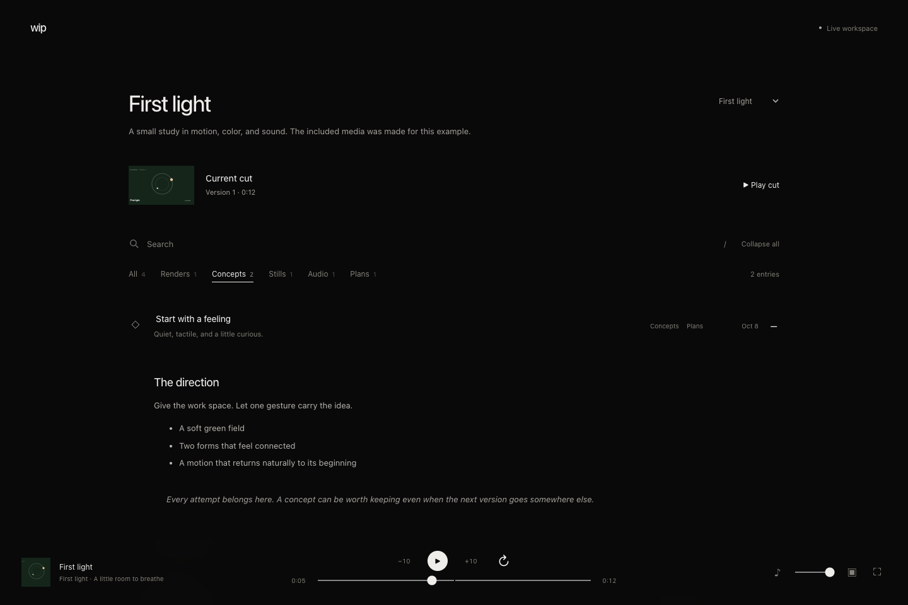
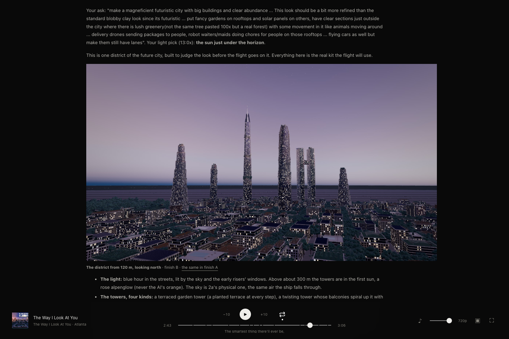

<div align="center">

# WIP

**A quiet place to review work in progress.**

Concepts, renders, notes, and the current cut — one list, one player.

[Get started](#get-started) · [Content guide](docs/content.md) · [Player guide](docs/player.md) · [Agent workflow](#made-for-people-and-agents)

</div>



WIP is a local, file-based review app for people making things with agents.
Keep an idea next to its first attempt, compare the next version, and leave the
current cut on repeat while you work. It works for music and film, design
studies, prototypes, or a collection of things you want to review.

**Runs locally · Plain JSON and Markdown · No account or database**

## A place for the whole process

| Feature | In use |
| :--- | :--- |
| **A simple list** | Expand the work you want to see. Keep the rest out of the way. |
| **Search and tags** | Search titles, notes, and written content. Click a tag to find renders, concepts, audio, or your own categories. |
| **One persistent player** | Keep listening as you browse. Show the synchronized picture when you need it, or watch fullscreen. |
| **The current cut** | Give the latest version a clear home without losing the attempts that came before it. |
| **Files you own** | One file per entry. Media stays in your project folders. Agents write through a CLI with revision checks. |
| **An optional static site** | Export explicitly selected projects for hosting. Local edits never publish themselves. |

## Get started

Requires **Node.js 22 or newer**.

```sh
git clone https://github.com/Imaginative-Prompting/wip.git
cd wip
npm ci
npm start
```

Open **[localhost:7353](http://127.0.0.1:7353)**. The included *First light*
example has an original motion loop, sound, a palette study, and a concept.
Select **First light**, then **Play cut** to try the player. The example is
self-contained; it needs no other repository or service.

To keep your own content outside the app, start with a copy of the example:

```sh
cp -R example ../my-wip
node bin/wip.mjs serve --config ../my-wip/wip.json
```

Stop the first server before starting another on the same port, or add
`--port 7355`. Follow the [workspace guide](docs/getting-started.md) to add your
projects and connect existing media folders.

## Find an idea without losing your place



Search includes the text inside collapsed entries. Tags describe the work;
review status is separate. Select more than one tag to see entries matching
**any** of them. Project, search, and tag selections are reflected in the URL.

## Keep the soundtrack running

The bottom player stays with you as you search, filter, and open entries. When
an audio track is paired with video, audio is the master clock. Hide the picture
to keep listening, then bring it back at the right point in the song.

Repeat, seeking, chapter markers, optional lighter video, and fullscreen all
use the same player. A new current-cut version waits for your selection instead
of interrupting the version you are playing.

| Key | Action |
| :--- | :--- |
| <kbd>Space</kbd> / <kbd>K</kbd> | Play or pause |
| <kbd>←</kbd> / <kbd>→</kbd> | Seek five seconds |
| <kbd>F</kbd> | Toggle fullscreen |
| <kbd>/</kbd> | Focus search |

See the [player guide](docs/player.md) for paired tracks, song-clock excerpts,
end screens, and the current-cut format.

## Made for people and agents

Agents add or update an entry rather than rebuilding a shared page. Each write
checks the revision that the agent read, so a second writer cannot silently
overwrite the first. The browser picks up changes while preserving playback.

```sh
# Read the entry and its revision.
node bin/wip.mjs get --config ../my-wip/wip.json \
  --project first-light --id direction

# After editing a working copy, use the revision you just read.
node bin/wip.mjs put --config ../my-wip/wip.json \
  --project first-light --file /tmp/direction.json --expected 1

# Check content and media references.
node bin/wip.mjs validate --config ../my-wip/wip.json
```

The bundled direction starts at revision `1`; use the actual current revision
for later updates. The [content contract](docs/content.md) covers entry fields,
media attachments, conflicts, and privacy rules. [AGENTS.md](AGENTS.md) gives
coding agents the repository conventions. Passing checks never implies human
creative approval.

## In use: the work behind the films



WIP also powers the work-in-progress collection at
[Imaginative Prompting](https://imaginativeprompting.com/wip/). This is a separate
film workspace; production media is not included in the standalone example.
The hosted collection is public and can be explored without signing in.

## Documentation

| Guide | What it covers |
| :--- | :--- |
| [Set up a workspace](docs/getting-started.md) | Configuration, project folders, your first entry, and local media |
| [Content contract](docs/content.md) | Entry schema, revision-safe writes, imports, and privacy rules |
| [Player and current cut](docs/player.md) | Shared transport, paired media, timing, and keyboard controls |
| [Static export](docs/exporting.md) | Project allowlists, media manifests, and hosting boundaries |
| [Development](docs/development.md) | Source map, checks, and screenshot capture notes |
| [Design](docs/design.md) | Spacing, typography, hover behavior, and the minimal interface |

Built with JavaScript, Node.js, and browser media APIs. Markdown is rendered with
[Marked](https://github.com/markedjs/marked) and sanitized with
[DOMPurify](https://github.com/cure53/DOMPurify).

Built and maintained by [Imaginative Prompting](https://github.com/Imaginative-Prompting).
This repository does not currently include a license.
